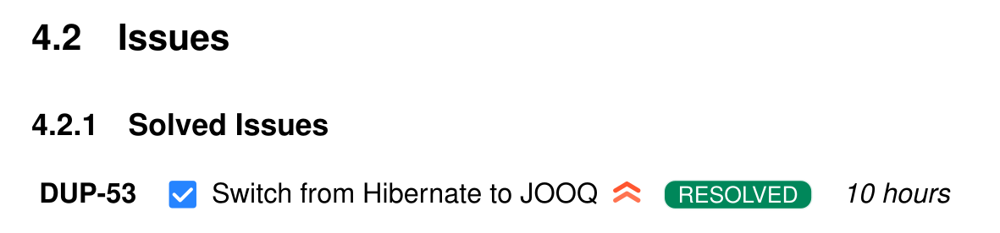

## Usage

* Create the environment: `conda devenv`
* Open `issues_to_latex_config.yaml` and configure it the way tou need. If you don't type your password there, 
it'll be asked on the command line. 
* Run `python issues_to_latex.py`, in case you get `JIRAError 403 CAPTCHA_CHALLENGE` open your browser and logout/login again on
Jira. 

After running `python issues_to_latex.py`, a `issues_to_latex.txt` is generated.

The `issues_to_latex.py` script expects a `issues_to_latex_config.yaml` on the same folder, 
so in case need to move the script, don't forget to move the config file as well. 


## Output example:

```latex
% ------------------ Solved Issues---------------------
\subsection{Solved Issues}
\jiraIssue[iKey=DUP-53, resolution=Done, title={Switch from Hibernate to JOOQ}, timeSpent=10 hours, priority=highest, type=task, status=RESOLVED, statusColor=green, labels={},description={}]

```


